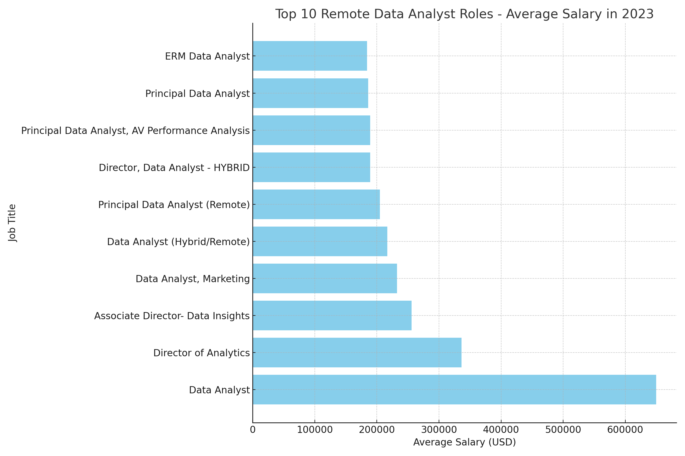
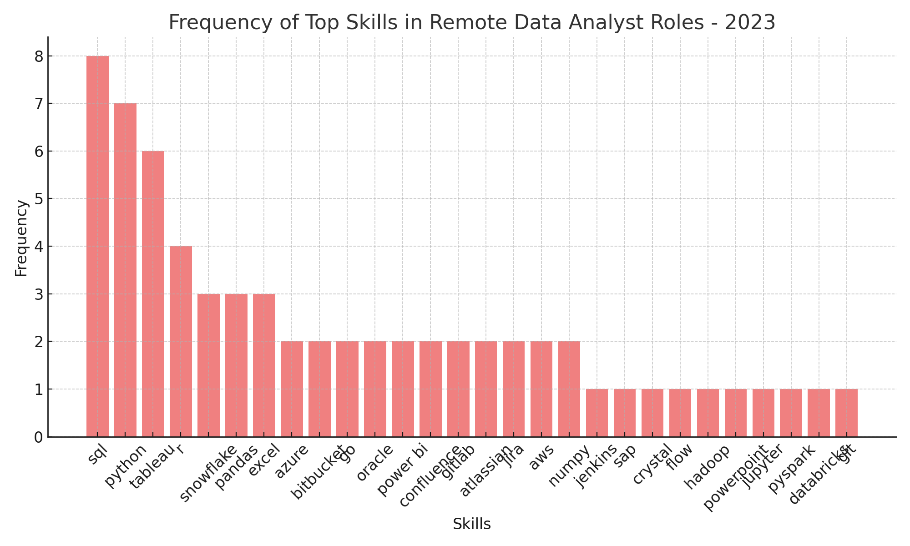
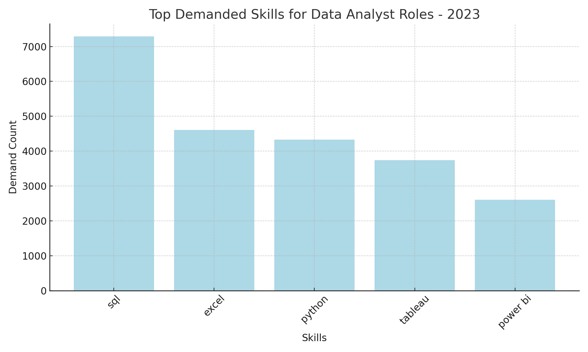
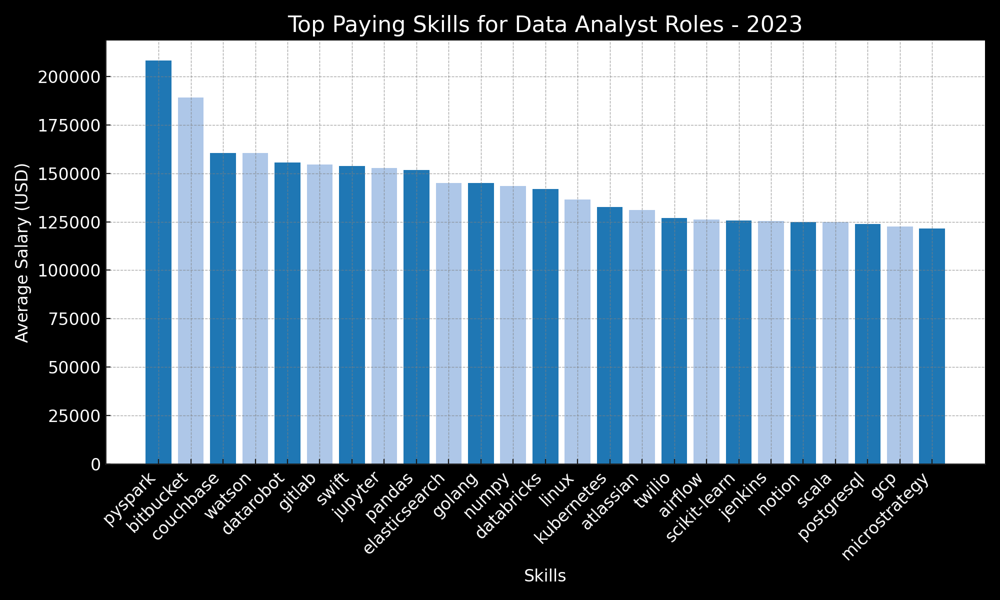
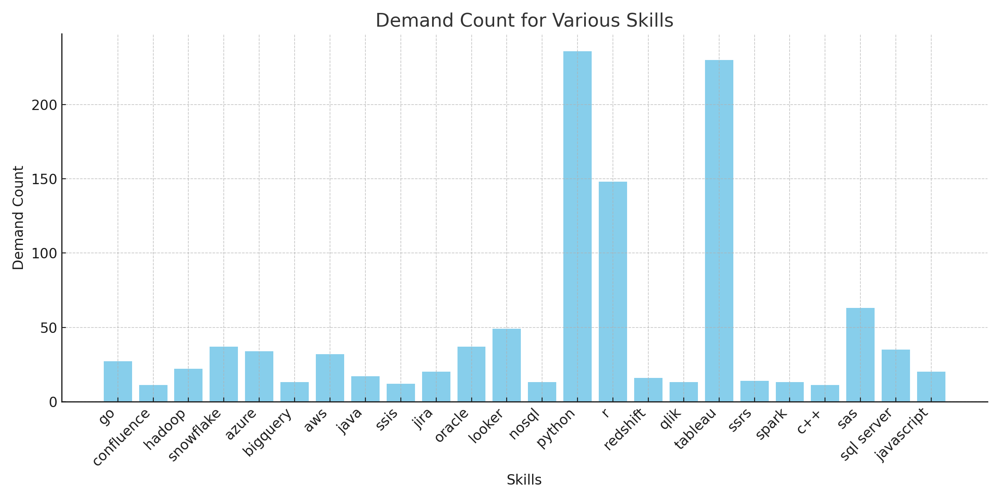

# Introduction
This SQL project involves a comprehensive analysis of the job market for data analyst roles. By querying and analyzing various datasets, the project aims to uncover key insights into job titles, companies, salaries, and essential skills required for these roles. The analysis is based on data from great single database with data about job postings, companies and skills. This project demonstrates the power of SQL in extracting, manipulating, and analyzing data to drive informed decisions and provide actionable insights.

You can check my SQL queries for this project here: [projet_sql folder](/project_sql/)

# Background
Before making this project I have studied the entire course on SQL by Luke Barousse. As first, I studied common used commands in SQL, solving problems in SQLiteviz straight on browser. Than as I progressed at my SQL skills to solve basic problems, I moved to the advanced section of course. After learning and solving problems which were based on using commands more complex commands like CTEs, subqueries, CASE and UNION. After completing the course I started work on this project.

The questions I wanted to answer through my SQL queries were:
1. What are the top-paying data analyst jobs?
2. What skills are required for these top-paying jobs?
3. What skills are most in demand for data analysts?
4. Which skills are associated with higher salaries?
5. What are the most optimal skills to learn?

# Tools I Used
To work on this project I used several key tools:
- **SQL**: The backbone of my analysis.
- **PostgreSQL**: Chosen database management system for work.
- **Visual Studio Code**: To download database files and to execute queries.
- **Git & GitHub**: To share this project publically.

# The Analysis

### 1. Top paying Data Analyst jobs 
The analysis of the top 10 remote data analyst roles in 2023 highlights the diversity and competitive nature of this job market. Data was gathered from various job postings, revealing key trends in job titles, companies, salaries, and employment types. This analysis aims to provide a clear understanding of the opportunities and compensation available for remote data analyst positions.

```sql
SELECT 
    job_id,
    job_title,
    job_location,
    job_schedule_type,
    salary_year_avg,
    job_posted_date,
    name AS company_name
FROM
    job_postings_fact
    LEFT JOIN company_dim ON job_postings_fact.company_id = company_dim.company_id
WHERE 
    job_title_short = 'Data Analyst'
    AND job_location = 'Anywhere'
    AND salary_year_avg IS NOT NULL
ORDER BY
    salary_year_avg DESC
LIMIT 10;
```

*Bar graph visualising the salary for the top 10 salaries for data analysts; Graph generated by ChatGPT from my SQL query results*

### 2. Skills for Top Paying Jobs
In 2023, the demand for remote data analyst roles has not only been influenced by job titles and salaries but also by the essential skills required. An analysis of the top-paying job postings reveals key skills that are highly sought after in the market. This summary highlights these skills and provides insights into their importance in securing top remote data analyst positions.

```sql
WITH top_paying_jobs AS (
    SELECT 
        job_id,
        job_title,
        salary_year_avg,
        name AS company_name
    FROM
        job_postings_fact
        LEFT JOIN company_dim ON job_postings_fact.company_id = company_dim.company_id
    WHERE 
        job_title_short = 'Data Analyst'
        AND job_location = 'Anywhere'
        AND salary_year_avg IS NOT NULL
    ORDER BY
        salary_year_avg DESC
    LIMIT 10
)

SELECT 
    top_paying_jobs.*,
    skills
FROM 
    top_paying_jobs
    INNER JOIN skills_job_dim ON top_paying_jobs.job_id = skills_job_dim.job_id
    INNER JOIN skills_dim ON skills_job_dim.skill_id = skills_dim.skill_id
ORDER BY 
    salary_year_avg DESC;
```

*Bar graph visualising the frequency of top skills for Data Analysts; Graph generated by ChatGPT from my SQL query results*

### 3. In-Demand Skills for Data Analysts
In 2023, the job market for data analyst roles has been significantly influenced by specific skills that are in high demand. An analysis of job postings reveals the top skills that employers are seeking in candidates for data analyst positions. This summary highlights these skills and provides insights into their importance in the job market.

```sql
SELECT 
    skills,
    COUNT(skills_job_dim.job_id) AS demand_count
FROM 
    job_postings_fact
    INNER JOIN skills_job_dim ON job_postings_fact.job_id = skills_job_dim.job_id
    INNER JOIN skills_dim ON skills_job_dim.skill_id = skills_dim.skill_id
WHERE
    job_title_short = 'Data Analyst'
    AND job_work_from_home = TRUE
GROUP BY 
    skills
ORDER BY
    demand_count DESC
LIMIT 5;
```

*Bar graph visualising top demanded skills for Data Analysts; Graph generated by ChatGPT from my SQL query results*

### 4. Skills Based on Salary
In 2023, certain skills have proven to be highly valuable in the job market for data analyst roles, commanding higher average salaries. An analysis of job postings reveals the top-paying skills that employers are willing to pay a premium for. This summary highlights these skills and provides insights into their significance in securing well-compensated data analyst positions.

```sql
SELECT 
    skills,
    ROUND(AVG(salary_year_avg), 2) AS avg_salary
FROM 
    job_postings_fact
    INNER JOIN skills_job_dim ON job_postings_fact.job_id = skills_job_dim.job_id
    INNER JOIN skills_dim ON skills_job_dim.skill_id = skills_dim.skill_id
WHERE
    job_title_short = 'Data Analyst'
    AND salary_year_avg IS NOT NULL
    AND job_work_from_home = TRUE
GROUP BY 
    skills
ORDER BY
    avg_salary DESC
LIMIT 25;
```

*Bar graph visualising top paying skills for Data Analysts; Graph generated by ChatGPT from my SQL query results*

### 5. Most Optimal Skills to Learn
In 2023, certain skills have emerged as optimal for data analyst roles, balancing high demand and competitive salaries. An analysis of job postings highlights these skills that are crucial for data analysts aiming to excel in their careers. This summary provides insights into these optimal skills and their impact on job opportunities and compensation.

```sql
WITH skills_demand AS (
    SELECT 
        skills_dim.skill_id,
        skills_dim.skills,
        COUNT(skills_job_dim.job_id) AS demand_count
    FROM 
        job_postings_fact
        INNER JOIN skills_job_dim ON job_postings_fact.job_id = skills_job_dim.job_id
        INNER JOIN skills_dim ON skills_job_dim.skill_id = skills_dim.skill_id
    WHERE
        job_title_short = 'Data Analyst'
        AND salary_year_avg IS NOT NULL
        AND job_work_from_home = TRUE
    GROUP BY 
        skills_dim.skill_id
), average_salary AS (
    SELECT 
        skills_job_dim.skill_id,
        ROUND(AVG(job_postings_fact.salary_year_avg), 2) AS avg_salary
    FROM 
        job_postings_fact
        INNER JOIN skills_job_dim ON job_postings_fact.job_id = skills_job_dim.job_id
        INNER JOIN skills_dim ON skills_job_dim.skill_id = skills_dim.skill_id
    WHERE
        job_title_short = 'Data Analyst'
        AND salary_year_avg IS NOT NULL
        AND job_work_from_home = TRUE
    GROUP BY 
        skills_job_dim.skill_id
)
SELECT 
    skills_demand.skill_id,
    skills_demand.skills,
    demand_count,
    avg_salary
FROM 
    skills_demand
    INNER JOIN average_salary ON skills_demand.skill_id = average_salary.skill_id
WHERE 
    demand_count > 10
ORDER BY
    avg_salary DESC,
    demand_count DESC
LIMIT 25;
```

*Bar graph visualising skills to learn, including the most optimal skills to learn; Graph generated by ChatGPT from my SQL query results*
# What I learned
- Complex Query Crafting: Mastered commands of advanced SQL commands.
- Data Aggregation: turned aggregate functions like COUNT() and AVG() into my data-summarizing sidekicks.

# Conclusion
### Insights
1. **Top-Paying Data Analyst Jobs:** Remote data analyst positions offer a wide range of salaries, with the highest reaching up to $650,000!
2. **Skills for Top-Paying Jobs:** Advanced proficiency in SQL is essential for high-paying data analyst roles, highlighting its importance for securing top salaries.
3. **Most In-Demand Skills:** SQL is the most sought-after skill in the data analyst job market, making it crucial for job seekers.
4. **Skills with Higher Salaries:** Specialized skills like SVN and Solidity command the highest average salaries, reflecting the premium placed on niche expertise.
5. **Optimal Skills for Job Market Value:** SQL stands out in demand and salary offers, making it one of the best skills for data analysts to enhance their market value.

This SQL project showcases the effectiveness of using SQL for data analysis in the context of job market research. The insights generated from the analysis provide a comprehensive understanding of the current landscape for data analyst roles, helping professionals make informed career decisions and organizations to better understand market trends. The project demonstrates the value of data-driven decision-making in today's competitive job market. And this is my first work in PostgreSQL, besides solving different problems apart.
